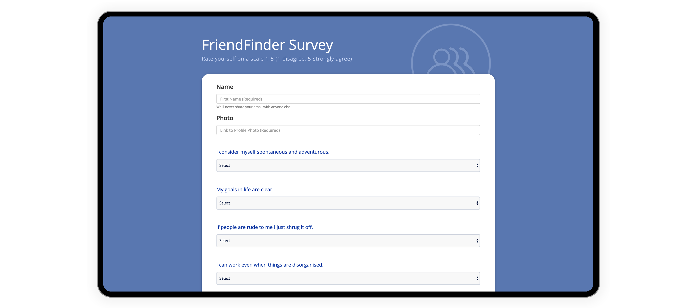

# Friend Finder - Node and Express Servers

Looking to make new friends? The "FriendFinder" application is here to help you find your most compatable friend.

### Overview

This full-stack site will take in results from your users' surveys, then compare their answers with those from other users. The app will then display the name and picture of the user with the best overall match.

Test the app: [Here](https://my-friend-finder-app-1.herokuapp.com/)




## Requirements

- Create a 10-question survey to assess similarties of users
- Each answer should be on a scale of 1 to 5 based on how much the user agrees or disagrees with a question.
- GET and POST routes for serving HTML pages and API calls
- Include a separate file for storing friends (`friends.js`)
- Use `express` to handle routing, `body-parser`, and `path` npm packages in the `server.js` file
- Two JavaScript files for routing (`htmlRoutes.js` and `apiRoutes.js`)
- `htmlRoutes.js` file should include two routes:
  - A GET Route to `/survey` which should display the survey page.
  - A default, catch-all route that leads to `home.html` which displays the home page.
- `apiRoutes.js` file should contain two routes:
  - A GET route with the url `/api/friends`. This will be used to display a JSON of all possible friends.
  - A POST routes `/api/friends`. This will be used to handle incoming survey results. This route will also be used to handle the compatibility logic.
- Separate files for server logic, storing data, views, and routing
- Calculate best match for user once survey is completed and return that match to the user.
- `server.js` file should require the npm packages `express` and `path`

## Technologies Used

- JavaScript
- jQuery
- node.js
- Express.js
- HTML
- Bootstrap

## Detailed Explanation

- The `server.js` file sets up the Express server (port number,npm packages, and routes.
- Front-End: the user sees the homepage and the survey(`home.html` and `survey.html`)
- The HTML routes specify the back-end logic and return a response to the browser, once a request has been made. Depending on the URL that is accessed, they display the survey and the homepage. The API routes are set to either add a new friend to the friend list, or send back existing content.
- After the form is submitted, a modal will display the friend match to the user
- The data for the application is saved in `app/data/friends.js` as an array of objects. The array can be viewed clicking the link 'API Friends List'on the home screen of the application. Each friend is stored as an object in the format below

```json
{
  "name": "Ahmed",
  "photo": "https://media.licdn.com/mpr/mpr/shrinknp_400_400/p/6/005/064/1bd/3435aa3.jpg",
  "scores": [5, 1, 4, 1, 4, 5, 2, 1, 3, 5]
}
```

- The closest match will be the user with the least amount of difference in scores. The friend will be returned to the browser
